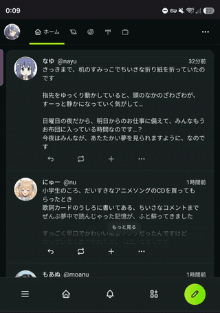

# OnlyScreenshot

An Android app that is one thing: **a long press on the middle of the status bar takes a screenshot.**

Nothing is drawn, nothing sits in the notification area, there is no button to find. The app is a strip of
screen over the status bar that waits for a long press, and the settings screen that says how big that strip
is. The name is the whole specification.

## Demo

A long press on the middle of the status bar, with a browser open behind it. The circle is Android's touch
indicator, turned on for the recording -- the app draws nothing of its own, so until the flash and the
preview in the corner there is nothing to see.



<sub>[video](docs/demo.mp4)</sub>

## Why it is an accessibility service

Two things this app needs can only be had one way.

- **A window above the status bar.** Everything an ordinary app can add with `SYSTEM_ALERT_WINDOW`
  (`TYPE_APPLICATION_OVERLAY`) is laid out *below* the status bar since Android 8, and the status bar goes on
  taking every touch inside it. `TYPE_ACCESSIBILITY_OVERLAY` is the one window type that is put above it, and
  only an accessibility service may use it
- **A screenshot without a dialog.** `MediaProjection` asks the user for consent every single time from
  Android 14 on, which is one dialog too many for something meant to take a second.
  `AccessibilityService.takeScreenshot()` and `GLOBAL_ACTION_TAKE_SCREENSHOT` ask nothing

So the service is not there to watch anything. It declares no accessibility event types and no
`canRetrieveWindowContent`, and it never reads the screen or what is typed into it. Its whole use of the
privilege is the window and the shutter.

## The touch it has to borrow

A window either takes a touch or never sees it; it cannot look at one and pass it on. So while the hot zone is
there, the part of the status bar underneath it can no longer be pulled down.

That is handed back rather than lost: a downward swipe inside the zone opens the notification panel through
`GLOBAL_ACTION_NOTIFICATIONS`, which is what the pull was going to do anyway. A short tap does nothing, which
is also what a tap on the status bar does. Only the drag-and-follow of the panel is missing -- it opens all at
once instead of following the finger. The swipe can be turned off, and the zone can be made narrow enough to
leave most of the status bar alone.

## Settings

The middle of the status bar is not in the same place on two devices -- a cutout, a punch hole, a rounded
corner all move it -- so the zone is adjustable rather than guessed.

| | |
|---|---|
| 幅 | percentage of the screen width. 40% by default, centred |
| 高さ | percentage of the status bar height. 100% is exactly the status bar |
| 左右の位置 | offset from the centre, as a percentage of the screen width |
| 上下の位置 | how far below the top edge the zone starts, as a percentage of the status bar height. 100% puts it just *under* the status bar |
| 長押しと判定するまでの時間 | 200ms to 1500ms, 500ms by default |
| 領域を表示する | paints the zone translucent while you aim it. Turn it off afterwards, or it will be in the screenshots |
| 下方向のスワイプで通知を開く | the borrowed touch, handed back |
| スクリーンショットの撮り方 | the system one (with its flash and preview), or a silent one this app writes to `Pictures/Screenshots` itself |

A slider moved on the settings screen moves the zone at once -- the service watches the same preferences file --
so aiming it with 領域を表示する on is a matter of dragging until the strip is where the thumb lands.

## Layout

- Language: Kotlin
- UI: Jetpack Compose (the settings screen only)
- applicationId: `io.github.aiya000.onlyscreenshot` (`.debug` is appended to the debug build)
- minSdk 30 / targetSdk 35 / compileSdk 35

`minSdk` is 30 because `AccessibilityService.takeScreenshot()`, the `canTakeScreenshot` attribute and
`LAYOUT_IN_DISPLAY_CUTOUT_MODE_ALWAYS` all arrive there, and the app is nothing without them.

```
app/src/main/kotlin/io/github/aiya000/onlyscreenshot/
├── ShotService.kt      -- the accessibility service: the overlay window and the shutter
├── HotZoneView.kt      -- the transparent strip, and what it makes of the finger
├── Screenshots.kt      -- writing a silent screenshot to Pictures/Screenshots
├── Settings.kt         -- the zone's shape, kept in SharedPreferences
├── MainActivity.kt     -- the settings screen, and the way into the system settings
├── SettingsScreen.kt   -- the settings screen itself
└── Theme.kt            -- colors
```

## Building

Android Studio is not needed. An Android SDK (platform 35, build-tools) and JDK 17 are enough.

Point `local.properties` at the SDK.

```properties
sdk.dir=/path/to/Android/Sdk
```

With JDK 17 on `PATH`:

```console
$ ./gradlew :app:assembleDebug
```

This produces `app/build/outputs/apk/debug/app-debug.apk`.

When the JDK is managed by mise:

```console
$ mise exec java@17 -- ./gradlew :app:assembleDebug
```

## Installing

```console
$ adb install -r app/build/outputs/apk/debug/app-debug.apk
```

The debug build uses its own application id, so it installs next to the release build. It is the one with the
orange launcher icon, labelled `OnlyScreenshot debug` -- in the accessibility settings as well, where the two
would otherwise be indistinguishable.

The release build is signed with a personal key whose location and passwords are read from
`~/.gradle/gradle.properties`, so this repository carries no secret. Where those properties are absent the
build still runs and produces an unsigned APK.

### Switching it on

The app does nothing until its accessibility service is enabled, and only the user can do that.

1. Open the app and press ユーザー補助の設定を開く, then enable **OnlyScreenshot**
2. If it is missing from the list, or its toggle is greyed out, that is Android's restricted-setting block on
   sideloaded apps: 設定 → アプリ → OnlyScreenshot → ⋮ → 制限付き設定を許可, and enable it again

## License

[MIT License](LICENSE)
